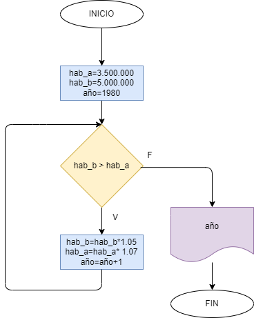

En 1980 la ciudad a tenia 3.5 millones de habitantes y una taza de crecimiento del 7% anual; y la ciudad b tenia 5 millones de habitantes y una taza de crecimiento del 5% anual. Si el crecimiento poblacional se mantiene constante en las dos ciudades, hacer el diagrama de flujo y el programa en Python que calcule e imprima en que año la poblacion de la ciudad a es mayor que la de la ciudad b.

## Diagrama de flujo

